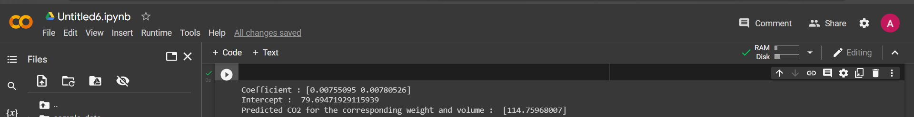

# Implementation of Multivariate Linear Regression
## Aim
To write a python program to implement multivariate linear regression and predict the output.
## Equipment’s required:
1.	Hardware – PCs
2.	Anaconda – Python 3.7 Installation / Moodle-Code Runner
## Algorithm:
### Step1:
Import pandas package.
### Step2
Import linear_model from sklearn.
### Step3
Read the csv.

### Step4:
Assign the values.
### Step5
Using linear_model.LinearRegression(), find linear regression.
## Program:
```
#Program to implement multivariate linear regression.
#Developed by Akshayaa M
#Register number: 22008405
import pandas as pd
from sklearn import linear_model
df=pd.read_csv("cars (1).csv")
x=df[['Weight','Volume']]
y=df['CO2']
regr=linear_model.LinearRegression()
regr.fit(x,y)
print("Coefficient :",regr.coef_)
print("Intercept : ",regr.intercept_)
predictedCO2=regr.predict([[3300,1300]])
print("Predicted CO2 for the corresponding weight and volume : ",predictedCO2)
```
## Output:



## Result
Thus the multivariate linear regression is implemented and predicted the output using python program.